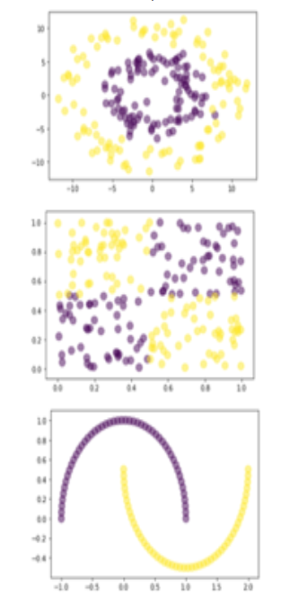

# Практическое задание
## KNN и Линейная регрессия
**Задание 1 (30%)**. Сгенерировать случайным образом 3 набора данных. Количество точек в каждом от 100 до 200. Цветом обозначены метки классов. 



Для каждого набора данных:

• Разделить датасет на train/test(80/20)

• Обучить и протестировать KNN

• Построить графики точности классификации(на train/test выборках) при разных k(1...8)

• Пользуясь стандартными методами из scikit-learn вычислить точность, полноту и F1-меру, построить матрицу расхождений

**Задание 2 (20%). Метрики.** 

25 объектов классифицированы на 3 класса

```Python
C="Cat"
F="Fish"
H="Hen"
# истинные значения
y_true = [C,C,C,C,C,C, F,F,F,F,F,F,F,F,F,F, H,H,H,H,H,H,H,H,H]
# результат системы
y_pred = [C,C,C,C,H,F, C,C,C,C,C,C,H,H,F,F, C,C,C,H,H,H,H,H,H]

```
Написать код на python, который воспроизводит вывод, представленный ниже (не используя сторонние библиотеки, кроме numpy):

```cmd
[[4 1 1]
 [6 2 2]
 [3 0 6]]
```

| | precision  | recall | f1-score|  support |
| ------------- | ------------- | ------------- | ------------- |------------- |
|  Cat | 0.308  | 0.667 | 0.421 | 6 |
|  Fish | 0.667  | 0.200 | 0.308 | 10 |
|  Hen | 0.667  | 0.667 | 0.667 | 9 |
||||||
| accuracy |  ||0.480 | 25 |
| macro avg |  0.547 | 0.511 | 0.465 | 25 |
| weighted avg | 0.581 | 0.480 | 0.464 | 25 |

**Задание 3 (50%). Линейная регрессия**
1. Самостоятельно выберите набор данных, над которым вы хотите работать. 
2. Загрузите  данные  и  напишите  код,  чтобы  разбить набор на  обучающий и тестовый наборы данных. Выберите как  минимум 3 переменных,  которые вы можете  использовать  для  прогнозирования  значений некоторой  целевой переменной в наборе.
3. Измерьте точность вашей модели на тренировочном и тестовом наборе данных. Обучите простую (одномерную) линейную  регрессию для  каждой  выбранной переменной. Какая из них дает лучший R^2?

